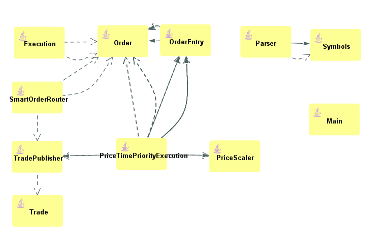
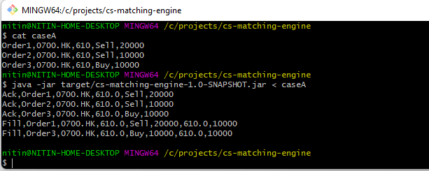

#Basic Model

### Simple design
Limit Order Book uses sparse arrays to store the prices to take the advantage of prices for an instrument being usually close to each other. 
There is one array for bids and other for asks just to maintain simplicity. 

`Order` can store both Limit or Market Order
`OrderEntry` holds the orders in an `OrderEntry` array, any collisions (same price) items will be stored on the same bucket

To run the program in command line, 

First build the program `mvn clean package`, pass the text file(e.g. caseA) as below:

